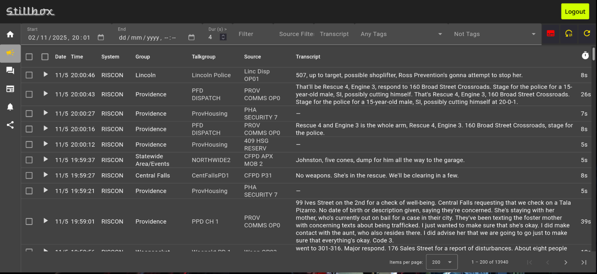

# stillbox

*"When they say stillbox, you know it's real."*

A Golang scanner call server and Angular frontend. Basically a rewrite of [rdio-scanner](https://github.com/chuot/rdio-scanner)
with a cleaner *backend* (not frontend, so far; I am not a frontend guy and it shows) and a more opinionated featureset.

Primary differences:

 - [x] Backend written as if Go is actually a typed language

   I never would have started this project if existing projects were this way, as modifying them would have been far easier.
   
 - [x] Call transcription using whisper.cpp.

   Just setup `transcribed` on a machine with a GPU (even the same machine) and point stillbox to it for call transcriptions.
   Then, use full-text search on the transcriptions in the database!

 - [x] No directory watch source, for now
 
   This is not a feature I need personally, but would be simple to implement as another [source](pkg/pipeline/sources/).

 - [x] Only supports Postgres DB right now. May add SQLite someday.

   Most all database access is abstracted using a repository architecture. The calls table is also partitioned, with configurable intervals and retention.

 - [x] Filter calls by duration in search

   This feature was a major impetus for even starting the project.

 - [x] Both REST and WebSocket APIs

   REST is used for the admin interface, and WebSockets/protobuf are used for listener apps, including *Calls* (both Flutter and terminal versions).

 - [x] Uses protobuf instead of JSON for the WebSocket API (no JSON arrays of numbers for call audio!)

   Another thing that originally spawned the project.

 - [x] Talkgroup activity alerting

   We use [go-trending](https://github.com/codesuki/go-trending) to implement this.

 - [x] "Native" flutter client (Calls) for Android/iOS/macOS/Linux/Windows (in progress)

   This client, as of this writing, works for listening linearly only. More functionality to come. Currently available [here](https://github.com/amigan/calls).

 - [x] RadioReference talkgroup import, SDRtrunk talkgroup playlist export

    Just copy and paste from RadioReference. You can also have your talkgroup labels in SDRtrunk!

 - [x] Incidents functionality (group past calls together and retain them)

   Keep track of interesting past calls and link them to your friends. Calls linked to an incident are even swept away before retention pruning is done!

 - [x] No premiumization nags or advertising of any kind

   Another thing that drove me to start this project. It's either Free Software, or it isn't, folks.

 - [x] 3-clause BSD license

   But that doesn't mean I don't want your improvements so that I may incorporate them!

## Note

If this message is still here, the database schema *initial migration* and protobuf definitions are **still subject to change**.

Once `stillbox` is actually usable (but not necessarily feature-complete), I will remove this note, and start using DB migrations and
protobuf best practices (i.e. not changing field numbers).

## Compatibility

`stillbox` is developed primarily on FreeBSD/amd64, with CI done on Linux/arm64. `calls` is tested primarily on Linux and macOS. The Web client is developed on
Linux and macOS, and tested on those systems and Android. It is a goal of the project to function on as many systems as possible. Contributions toward this goal, of code
or bug reports, are always welcome.

## License and Copyright

© 2024, 2025 Daniel Ponte <dan AT dynatron DOT me>

Licensed under the 3-clause BSD license. See LICENSE for details.

## Credits

Thanks to, among others:
* rdio-scanner for the original inspiration
* [sdrtrunk](https://github.com/DSheirer/sdrtrunk), without which this would all be moot
* [go-trending](https://github.com/codesuki/go-trending) and [go-time-series](https://github.com/codesuki/go-time-series)
* [isoweek](https://github.com/snabb/isoweek)
* [minimp3](https://github.com/tosone/minimp3)
